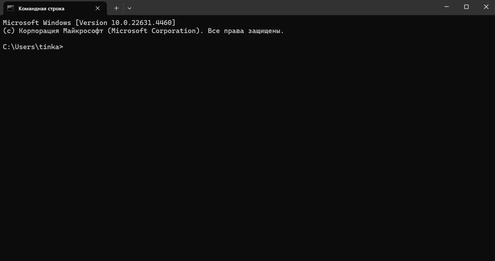

# Octrix Game

Это реализация классической игры Octrix на Python. Игра основана на оригинальной версии из BASIC, но адаптирована для современных систем.

## Описание игры

Octrix - это карточная игра, где каждому игроку раздается по 8 карт (от туза до восьмерки). Карты ранжируются по мастям бриджа, где туз треф является самой низкой картой, а восьмерка пик - самой высокой. Цель игры - выиграть как можно больше взяток из восьми возможных.

## Особенности

- Поддержка от 1 до 4 игроков
- Возможность игры против компьютера
- Система подсчета очков с бонусами за последовательные выигрыши
- Точное воспроизведение механики оригинальной игры
- Три версии игры: для Windows, Linux и веб-версия

## Требования

### Для Windows-версии
- Python 3.x

### Для Linux-версии
- Python 3.x
- pip (менеджер пакетов Python)
- git (для клонирования репозитория)

### Для веб-версии
- Python 3.8 или выше
- Виртуальное окружение Python (venv)
- Flask==3.0.0
- Werkzeug==3.0.1
- waitress==2.1.2
- flask-socketio
- Браузер с поддержкой JavaScript

## Установка и запуск

### Windows
1. Убедитесь, что у вас установлен Python 3.x
   ```bash
   python --version
   ```

2. Склонируйте репозиторий:
   ```bash
   git clone https://github.com/krisrozhok/octrix-game.git
   cd octrix-game
   ```

3. Запустите игру одним из способов:
   - Через Python напрямую:
     ```bash
     python main.py
     ```
   - Через make (если установлен):
     ```bash
     make run
     ```

### Linux
1. Убедитесь, что у вас установлены необходимые пакеты:
   ```bash
   # Для Ubuntu/Debian
   sudo apt update
   sudo apt install python3 python3-pip git

   # Для Fedora
   sudo dnf install python3 python3-pip git

   # Для Arch Linux
   sudo pacman -S python python-pip git
   ```

2. Склонируйте репозиторий:
   ```bash
   git clone https://github.com/krisrozhok/octrix-game.git
   cd octrix-game
   ```

3. Создайте виртуальное окружение:
   ```bash
   python3 -m venv venv
   source venv/bin/activate
   ```

4. Запустите игру:
   ```bash
   python3 main.py
   ```
   или через make:
   ```bash
   make run
   ```

### Веб-версия

#### Первичная настройка

1. Перейдите в директорию веб-версии:
   ```bash
   cd octrix-web
   ```

2. Создайте виртуальное окружение:
   ```bash
   python -m venv .venv
   ```

#### Запуск сервера

1. Активируйте виртуальное окружение:
   ```bash
   # Для Windows
   .venv\\Scripts\\activate

   # Для Linux/MacOS
   source .venv/bin/activate
   ```

2. Установите зависимости:
   ```bash
   pip install Flask==3.0.0 Werkzeug==3.0.1 waitress==2.1.2
   pip install flask-socketio
   ```

3. Перейдите в директорию с исходным кодом:
   ```bash
   cd src
   ```

4. Запустите сервер:
   ```bash
   python app.py
   ```

5. Откройте в браузере: http://localhost:5000

## Как играть

- При запуске игры вам будет предложено ознакомиться с правилами (ответьте Y на вопрос "TEACH GAME?")
- Укажите количество игроков (1-4)
- Введите имена игроков
- Решите, будет ли компьютер участвовать в игре
- Установите количество очков для победы (по умолчанию 88)

### Формат ввода карт
- Используйте двухсимвольный формат: значение + масть
- Значения: A (туз), 2-8
- Масти: C (трефы), D (бубны), H (червы), S (пики)
- Пример: "AC" для туза треф, "8S" для восьмерки пик
- Введите 'P' чтобы посмотреть свои карты

## Структура проекта

```
octrix-game/
├── src/              # Исходный код основной версии
├── octrix-web/       # Веб-версия
│   ├── src/
│   │   ├── app.py   # Основной файл сервера Flask
│   │   ├── templates/
│   │   └── static/
│   └── .venv/
└── README.md
```

## Демонстрация работы

### Windows версия


### Linux версия


### Веб версия


## Возможные проблемы

### Linux
- Если возникает ошибка прав доступа при запуске:
  ```bash
  chmod +x main.py
  ```

- Если терминал некорректно отображает символы:
  ```bash
  export PYTHONIOENCODING=utf-8
  ```

- Если make не установлен:
  ```bash
  # Для Ubuntu/Debian
  sudo apt install make

  # Для Fedora
  sudo dnf install make

  # Для Arch Linux
  sudo pacman -S make
  ```

### Веб-версия

#### Порт 5000 занят
Измените порт в файле `app.py`:
```python
if __name__ == '__main__':
    app.run(port=5001)  # Измените на другой свободный порт
```

#### Проблемы с виртуальным окружением
1. Удалите папку .venv
2. Создайте новое окружение: `python -m venv .venv`
3. Активируйте окружение и переустановите зависимости

#### Обновление pip
```bash
python -m pip install --upgrade pip
```

## Очистка временных файлов

Для очистки кэша и временных файлов Python:
```bash
make clean
```

## Автор
krisrozhok <3